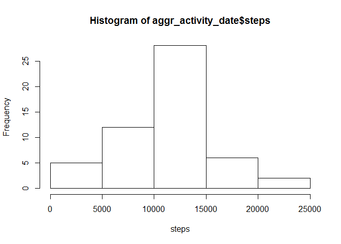
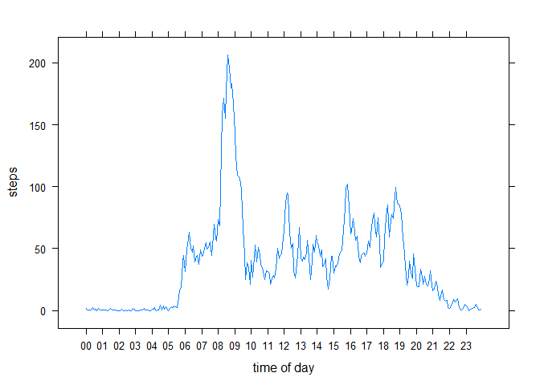
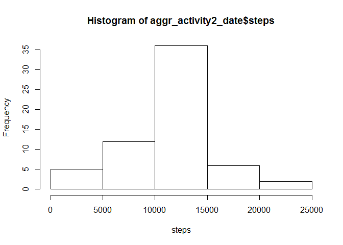
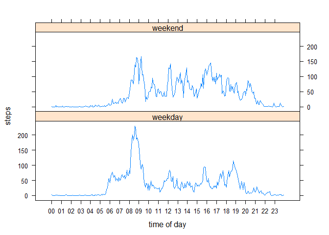

# Reproducible Research: Peer Assessment 1
Ilia Semenov  

## Loading and preprocessing the data
First we load and process the data. Processing part transfroms the interval
identificator to proper time format ("hh:mm") and concatinating
data column and interval identificators to create a proper date/time column
with the date foremat "%Y-%m-%d %H:%M".

```r
library(stringr)
activity<-read.csv("activity.csv")
#turning interval values to time format "hh:mm"
activity$interval<-str_pad(activity$interval, 4, pad = "0")
activity$interval<-gsub('^([0-9]{2})([0-9]+)$', '\\1:\\2', activity$interval)
#combining date and time to datetime column of 'date' type
activity$datetime<-paste(activity$date, activity$interval, " ")
activity$datetime<-strptime(activity$datetime,"%Y-%m-%d %H:%M")
```


## What is mean total number of steps taken per day?
To get the mean total number of steps taken per day we aggregate the dataframe 
with date column as grouping base and sum of steps as aggregation. We ignore the
missing values here.

```r
#aggregating steps by day
aggr_activity_date<-aggregate(steps~date, data=activity,FUN=sum, na.rm=TRUE)
```
Next we show the aggregation result by creating histogram of the total number 
of steps taken each day.

```r
hist(aggr_activity_date$steps,xlab="steps")
```

 

The mean number of steps taken each day is as follows:

```r
mean(aggr_activity_date$steps)
```

```
## [1] 10766.19
```
The median number of steps taken each day is as follows:

```r
median(aggr_activity_date$steps)
```

```
## [1] 10765
```

## What is the average daily activity pattern?
To find out the average daily activity pattern we aggregate the data across all 
available days by the time intervals (5 mins). We use mean as an aggregation 
function as we want  to find out average number of steps person makes within the
corresponding time within all available days. We also ignore the missing values 
here.

```r
#aggregating steps by 5 minute time interval across all days
aggr_activity_5min<-aggregate(steps~interval, data=activity,FUN=mean, na.rm=TRUE)
```

Further, we plot the result of aggregation revealing the average daily activity 
pattern.Before plotting we trnsform the trainterval column from text to datetime 
format (POSIXct) as we want the plot to show things correcly (if numeric values 
introduced instead, the gaps between intervals are shown on the graph, e.g.
1755-1800 has 45 between them, but indeed these are two consecutive data
points). We then use lattice plot library to create the plot and format x axes
so that they show hours of the day (00 to 23).

```r
library(lattice)
#turning interval value from text to date format
aggr_activity_5min$interval <- as.POSIXct(aggr_activity_5min$interval , 
                                          format="%H:%M")
xyplot(steps~interval,data=aggr_activity_5min,type="l",
       xlab="time of day",
       scales=list(
     x=list(at= seq(min(aggr_activity_5min$interval),
                    max(aggr_activity_5min$interval),
                         by="hour"), 
     labels=format(seq(min(aggr_activity_5min$interval),
                       max(aggr_activity_5min$interval),
                         by="hour"),
                   "%H"))))
```

 

As we can see from the plot, the peak of activity is happening in the morning - 
probably person is doing some morning excersize or goin to work by feet. The 
maximum number of steps appears to be during the following time interval:

```r
format(aggr_activity_5min$interval[aggr_activity_5min$steps
                            ==max(aggr_activity_5min$steps)],
       "%H:%M")
```

```
## [1] "08:35"
```

## Imputing missing values
The initial data has quite a bit of missing values for step count. Before we were
ignoring them, but now we want to assign the values based on some logic.
The total number of rows with missing values in thre initial data is as follows:

```r
length(activity$steps[is.na(activity$steps)])
```

```
## [1] 2304
```

To replace the missing step data we decided to use the average number of steps
for the corresponding time intervals (the same thing we dealt with in the 
previous section). We decided not use the average number of steps within 
corresponding day as there are some days where we have all the data missing (so, 
for these days we cannot obtain average).
From the initial dataset w create the new one with the NA values replaced based
on the logic described above.

```r
#creatin the new dataset with the NA values replaced based be the interval
#averages
activity2<-transform(activity, 
          steps = ifelse(is.na(steps), 
                          ave(steps, interval, FUN = function(x) 
                                  mean(x, na.rm = TRUE)), 
                          steps))
```
Once we have the dataset without missing values, we aggregate it based on date
column (by day) and using sum function to learn the new number of steps person
did within each day.

```r
aggr_activity2_date<-aggregate(steps~date, data=activity2,FUN=sum, na.rm=TRUE)
```
We show the aggregated data with histogram. If you compare it with the histogram
of the data with ignored NAs, you will see that the number of days with 10k to 
15k steps (the most common) increased significantly.

```r
hist(aggr_activity2_date$steps, xlab="steps")
```

 

As we calculate the mean and mediam for the new data, we see that they now match
which means that the data is not skewed at all. When we had NAs our mean was 
higher than median, which meant slighrt skewing to the right.

```r
mean(aggr_activity2_date$steps)
```

```
## [1] 10766.19
```

```r
median(aggr_activity2_date$steps)
```

```
## [1] 10766.19
```


## Are there differences in activity patterns between weekdays and weekends?
To find out the differences in activity patterns between weekdays and weekends
we use the data with replaced missing values and introduce the weekday/weekend
factor column into it. Then we aggregate data based on two groups - time inteval
and day type (weekday/weekend) using the mean aggregation function for steps.
As a result we get the average daily pattern for weekdays and weekends separately.
By putting two sets of data into two diffrent plots, we can compare the
activity patterns between weekdays and weekends.

```r
library(lattice)

#introduce the weekend/weekday factor
activity2$day_type<-as.factor(ifelse(weekdays(activity2$datetime)=="Saturday"|
                                 weekdays(activity2$datetime)=="Sunday", 
                          "weekend", 
                          "weekday"))

#aggregate data based on interval and day type groups
aggr_activity2_5min_daytype<-aggregate(steps~interval+day_type, data=activity2,
                                       FUN=mean, na.rm=TRUE)
aggr_activity2_5min_daytype$interval <- 
        as.POSIXct(aggr_activity2_5min_daytype$interval, format="%H:%M")
#lattice plot
xyplot(steps~interval|day_type,data=aggr_activity2_5min_daytype,type="l",
       xlab="time of day", layout=c(1,2),
       scales=list(
     x=list(at= seq(min(aggr_activity2_5min_daytype$interval),
                    max(aggr_activity2_5min_daytype$interval),
                         by="hour"), 
     labels=format(seq(min(aggr_activity2_5min_daytype$interval),
                       max(aggr_activity2_5min_daytype$interval),
                         by="hour"),
                   "%H"))))
```

 

As we can see from plots above, there are definitely differences between weekday
and weekend activity patterns. Maximum number of steps on weekdays is higher and
occures in the morning around 08:35 (as we determined earlier) - the person most
likely is walking to work. Further in the day the number of steps is much lower
(around 50 vs 250 in the morning) - the work is most likely sitting one with
ocasional walks around office. On weekends, the maximum number of steps is lower,
but looks like on average person is making more steps - around 100. This means
that the person is very active on weekends doing walking around shops or 
excersizing. The mean of average steps on weekend and weekday is shown below:

```r
tapply(aggr_activity2_5min_daytype$steps,aggr_activity2_5min_daytype$day_type, mean)
```

```
##  weekday  weekend 
## 35.61058 42.36640
```


